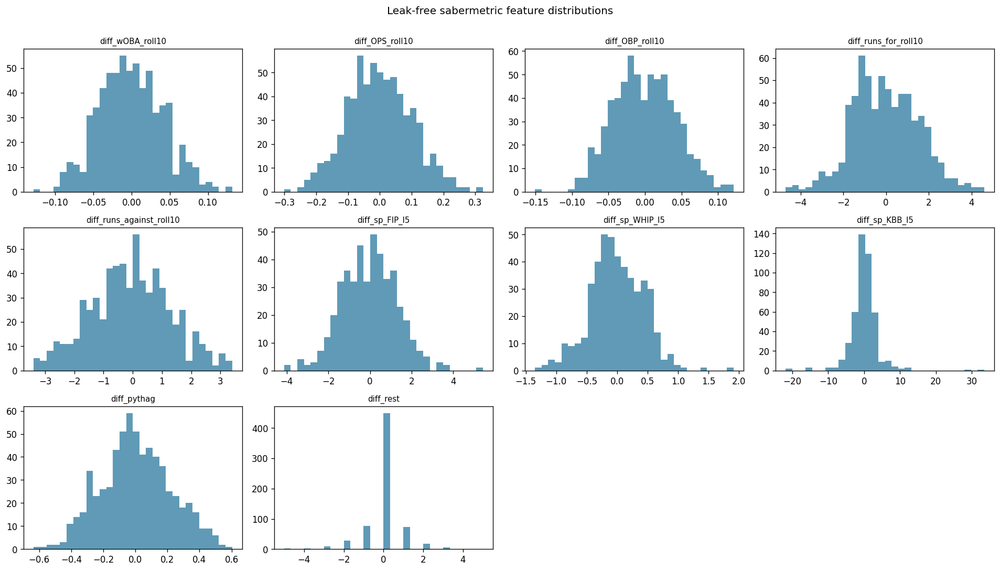
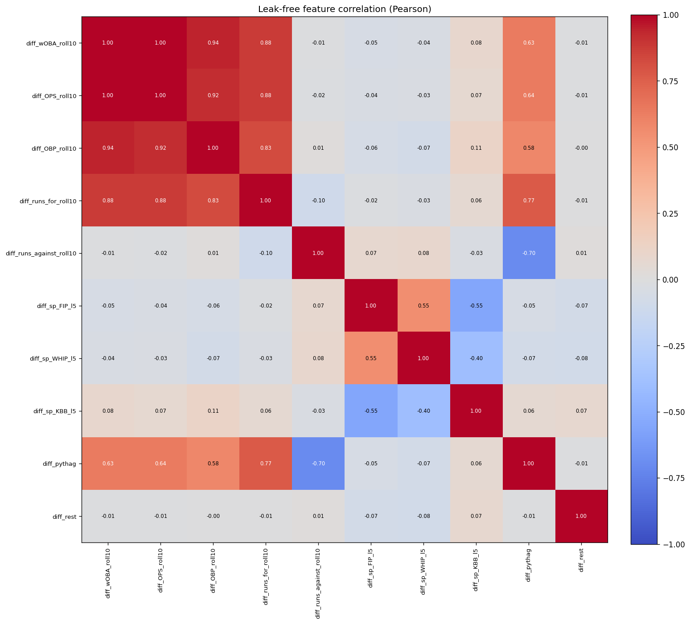
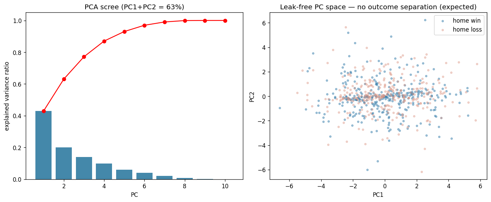
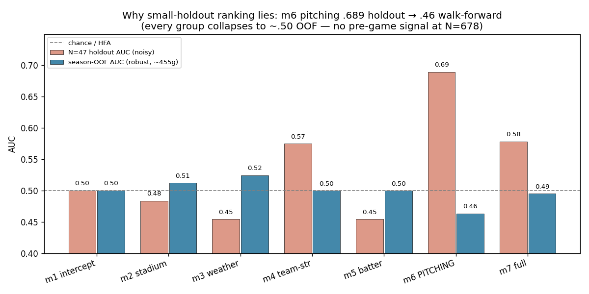
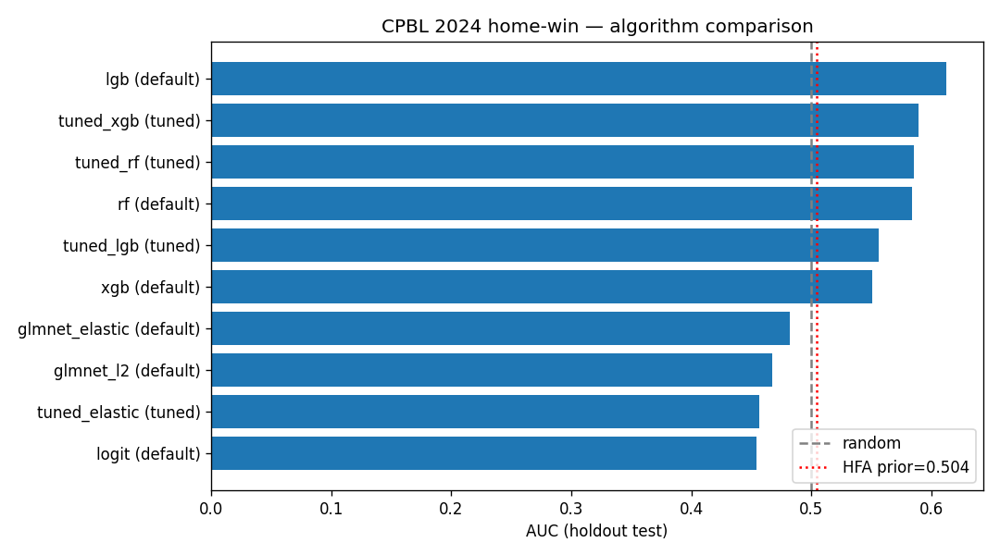
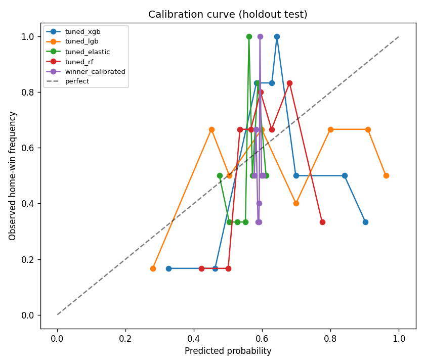
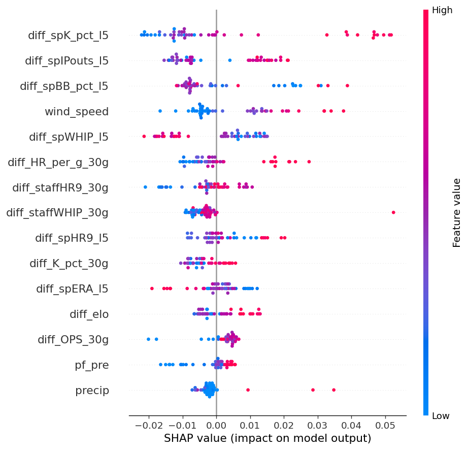
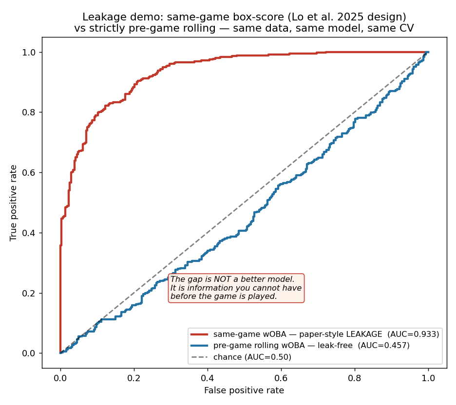
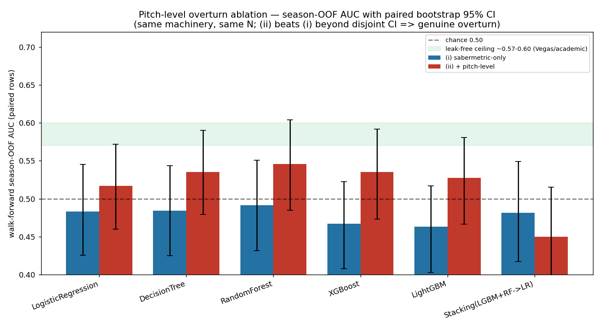

# CPBL 主客場勝率預測 — 期末報告

**課程**：資料科學（NCCU，114-2）　**任務**：二元分類 `is_home_win`
**資料**：野球革命 rebas open data（2023–2024）＋ Open-Meteo　**實作**：
Python（單一自含 notebook `python/cpbl_pipeline.ipynb`）

> 本報告依資料科學生命週期五步驟組織：**定義目標 → 獲取資料 → 探索資料
> → 建立模型 → 評估模型**，末接結論、部署與可重現性。所有量化數字均
> 取自已定案、版本控管的產出物（`Results/eval/_final_metrics.json`、
> `results_*.csv`、`reports/03_step1_to_step3.md`），未於撰稿時重算。
> 技術細節索引：`Results/01_define_the_goal.md`（charter）、
> `reports/02a_cde52470_data_audit.md`（資料審計）、
> `reports/03_step1_to_step3.md`（pipeline 與 Run A–E 完整數據）、
> `reports/progress.md`（決策日誌）。

---

## 摘要

本研究探討一個明確的問題：**僅憑賽前可得資訊，能否預測一場尚未開打的
CPBL 例行賽主隊是否獲勝？** 我們在兩季（2023–2024，678 場）公開資料上，
建立一條時序嚴謹的評估管線——時間感知切分、walk-forward 樣本外（OOF）
預測、以交叉驗證 AUC（而非雜訊極大的小樣本 holdout）選模、bootstrap
信賴區間、單一校準與雙閾值報告——並以 m1–m7 漸進消融量化球場、天氣、
球隊戰力、打者狀態、投手等五組特徵各自的邊際貢獻。

結果是一個**乾淨且可辯護的負面結論**：在嚴謹的樣本外評估下，**沒有任何
特徵組能與「純主場優勢」區分**；各組 season-OOF AUC 全部落在 0.50 附近
一個約 ±0.05 的帶內（圖 4）。最具啟發性的是投手組：它在 47 場 holdout
上達到看似亮眼的 AUC 0.689，卻在 leak-free walk-forward 上跌至 0.463——
這正是本管線設計要捕捉的小樣本假訊號，且是繼 Run A 之後**第二次**被同
一套方法論自動戳破。

因此，**本專案真正的貢獻不是一個高 AUC 數字，而是一套能正確揭露「此問
題在現有資料下接近不可預測」的嚴謹方法論**。此結論與運動預測文獻一致：
即使是職業運動最強的賽前預測者——Las Vegas 盤口（含完整市場資訊）——在
MLB 上也僅達約 58.2% 準確率，學術機器學習模型約 57–59.5%。兩季 CPBL
資料得到 ≈0.50–0.53 的樣本外 AUC，是理論預期內的結果，而非專案失敗。

---

## 1. 定義目標 Define the Goal

> *"What problem am I solving?"* — 資料科學生命週期的第一個節點；
> 若目標模糊，所有下游工作都會耗在錯誤的標的上。

### 1.1 業務問題與分析單位

本研究的可交付預測是：對一場**尚未開打**的 CPBL 例行賽，輸出主隊獲勝
機率 `P(is_home_win = 1)`。分析單位為「一場比賽」；目標變數
`is_home_win ∈ {0, 1}`，平手場次（極少數）剔除，使問題成為乾淨的二元
分類。利害關係人中以「運彩分析師」對模型要求最嚴苛——他不只要排序能力
（AUC），更需要**機率校準**：一個 AUC 高但系統性過度自信的模型，與盤口
對賭時會直接虧損。此需求是本報告自始至終堅持同時報告 Brier 分數與校準
曲線、且採單一保守校準的根本原因。

### 1.2 預先登記的成功門檻與假設

為避免「先看結果再挑指標」的事後合理化，本專案在 `Results/01_define_
the_goal.md` 中**事前**登記了可證偽的成功門檻與假設（下表）。這份預先
登記本身就是本研究方法論誠信的核心：第 5 節將逐條對帳，並誠實報告其
達成與否。

| 代號 | 門檻／假設 | 通過條件 | 檢定方法 |
|---|---|---|---|
| (a) 必勝 | Test AUC 顯著優於 m1 截距 | 高於 m1 95% bootstrap CI 上界 | bootstrap + DeLong ΔAUC |
| (b) 可發表 | Test AUC ≥ 0.60 | — | — |
| (c) 可部署 | Test AUC ≥ 0.62 且校準良好 | — | — |
| HS | 球場有獨立訊號 | 加入後 AUC 上升且 LRT p<0.05 | LRT + DeLong |
| HW | 天氣有獨立訊號 | 加入後 AUC 上升且 LRT p<0.05 | LRT + paired bootstrap |

### 1.3 實作路線的誠實聲明

charter 原規劃以 R／`tidymodels` 為主要建模框架。實作期間發現
`tidymodels` 在 Colab 環境執行過慢，且授課教師後續允許使用 Python，
故**全流程改以 Python 實作**，R 程式碼降級為僅供交叉驗證的參考鏡像
（保留於 `R/`，非執行路徑）。此外，charter 原始的 m1–m7 中 m6 定義為
「球場＋天氣」組合；該組在實測中 season-OOF 僅約 0.467（與雜訊無異），
故將 m6 槽位**改鎖定為「投手」**——這是 rebas 資料中唯一尚未開採、且
最可能帶來訊號的槓桿。概念上的五步驟生命週期不變，但實作框架與 m6 的
語意確有上述調整，於此明確聲明，以免與 `Results/01_define_the_goal.md`
表面文字產生矛盾。

---

## 2. 獲取資料 Acquire Data

> *"What information do I need?"* — 從 charter 到證據的橋樑；
> 原始資料視為寫一次、永不竄改、永遠可重現的 WORM 儲存。

### 2.1 資料來源與合法性

所有資料來自公開、免金鑰來源，並嚴格遵守課程限制（**禁用 Kaggle 與
任何預打包資料集**）：

- **比賽資料**：野球革命 rebas open data，使用 release
  `v0.1.0-2024`、`v0.1.0-2023.0`、`v0.1.0-2023.1`（**rebas 無 2022
  release**）。每個來源檔的 SHA256 記入 `data/raw/_provenance/`，達到
  位元級可重現。rebas 的 `homeBatterBox / awayBatterBox /
  homePitcherBox / awayPitcherBox` 提供逐場、逐球員的打擊與投球成績。
- **天氣資料**：原規劃中央氣象署 CODiS，實作時遭遇 CAPTCHA／session
  阻擋而失敗；改用 **Open-Meteo Archive API**（ERA5 重分析，免金鑰，
  且 ERA5 本就吸收 CWA 測站觀測）。step1b 設有硬失敗保護：球場座標
  缺失或天氣缺漏率 >50% 時直接 `SystemExit`，**絕不靜默寫入 NA 天氣**。

值得強調：投手成績 rebas `pitcherBox` 本就完整提供——**本專案不需要
任何爬蟲，也不需要 CWA 金鑰**。

### 2.2 一個值得記錄的資料工程教訓

rebas 2024 release 使用 ASCII 檔名（`CPBL-2024-OpenData.json`），但
**2023 release 使用中文檔名**（`中職2023年-OpenData.json`、
`中職2023年下半季-OpenData.json`、`中職2023年-季後挑戰賽-OpenData.json`、
`中職2023年-台灣大賽-OpenData.json`，共四種）。原始程式以寫死的
`CPBL-*` glob 探索檔案，**靜默地吃掉整個 2023 賽季且不報任何錯誤**，
使樣本數長期卡在 366。修正 glob 為 `*OpenData*`（仍正確排除逐場
`*-G<N>.json`）後，樣本數由 366 增至 **678**。此教訓——靜默資料遺漏
比程式崩潰更危險——直接促成可重現性設計中的明確驗證機制（第 8 節）。

### 2.3 樣本規模與時間切分

最終可用樣本 678 場。採用**嚴格時間感知切分（絕不隨機切分，因為這是
時間序列運動資料）**：

| 切分 | 時間窗 | N |
|---|---|---|
| train | < 2024-08-01（2023 全季皆落於此） | 406 |
| valid | 2024-08-01 .. 2024-09-15 | 97 |
| test（holdout） | ≥ 2024-09-16（季末＋季後賽） | 47 |
| post-warmup（滾動特徵熱身後可用） | — | 550 |

holdout 僅 47 場——這個極小的測試集，正是後續 Run A 與 Run D 兩次
產生假訊號的根源，也是本研究堅持以 season-OOF 為主要指標的原因。

---

## 3. 探索資料 Explore the Data

> *"Find patterns that lead to solutions."* — EDA 是最便宜的地方
> 殺掉壞假設、挖出資料品質地雷。

### 3.1 球場效應與資料品質

時間感知（leave-one-out）的 Park Factor 揭示明確的球場差異：澄清湖
≈1.18（打者友善）、天母 ≈0.86（投手友善），其餘介於兩者之間
（`data/processed/park_factors.csv`）。缺漏審計與插補決策樹記於
`reports/02a_cde52470_data_audit.md`；平手場剔除規則於該處明列。

### 3.2 投手 schema 驗證

由於投手是本季新增的關鍵特徵，我們在建模前以診斷程式（notebook
Cell 4）直接驗證 rebas `pitcherBox` 的真實結構，而非僅信任文件：
**每場每邊恰好有一筆 `order == 1`（1356 個 game-side 中 0 例外）**，
先發投手識別因此完全可靠；欄位為
`IPOuts / NP / BF / H / HR / BB / IBB / HB / SO / R / ER`（較 schema
文件更豐富）。每位先發的出賽場次中位數僅約 10 場——此分布直接決定了
特徵設計採「近 5 場滾動 ＋ 不足 3 場時以中位數回退」的冷啟動策略
（第 4 節）。

### 3.3 非監督探索：PCA 與 K-means

為從另一個角度檢視特徵空間，notebook Cell 7b 進行兩項**純探索性**
分析，**明確不餵入 m1–m7 模型**：

- **天氣 PCA**：對溫度、濕度、風速、降水四變數標準化後做主成分分析
  （scree 圖 ＋ PC1–PC2 散點依勝負上色）。主成分空間中**主隊勝／負
  兩群完全重疊、無可分性**，與後續「天氣是最弱特徵組（season-OOF
  ≈0.524，與雜訊無異）」的結論一致。（此 v1 探索圖未納入本交付圖集；
  其結論由下方 v2 leak-free 特徵 EDA 圖以更廣的特徵集獨立重現。）
- **比賽輪廓 K-means**：對所有 `diff_*` 比賽輪廓特徵標準化後分群
  （k=4，為**文件化的探索選擇、非調參結果**）。分群確實找到不同的
  「打法輪廓」，但**各群的主隊勝率幾乎持平於整體基準線**——亦即結構
  存在於*打法*之中，卻不存在於*勝負*之中。（圖未納入交付集，結論記於
  `reports/progress.md`。）

這兩項分析的價值在於：它們以非監督方法，從與監督式消融完全不同的
角度，**獨立印證了「賽前無可預測訊號」這個負面結論**，而非被用來
提升 AUC。

### 3.4 v2 leak-free 特徵 EDA（交付圖集）

下列三張為 v2 管線（`python/cpbl_pipeline_v2.ipynb` STEP 3c）對
**嚴格賽前 leak-free 特徵**所做的 EDA，取代未交付的 v1 探索圖、
並以更廣特徵集重現同一結論：

PCA（圖 3）中主隊勝／負兩群在主成分空間**完全重疊**——結構存在於
特徵之間（相關矩陣，圖 2）卻不存在於與勝負的關係之中，與 §5 的
監督式負面結論完全一致。

---

## 4. 建立模型 Build the Model

> *"Build the model."* — m1–m7 漸進消融：先固定演算法、變動特徵組以
> 量化各組邊際貢獻；再固定特徵、變動演算法以選引擎。

### 4.1 特徵工程（全部 leak-free）

所有特徵嚴格只使用比賽前可得的資訊；所有滾動統計只取該隊／該投手的
**先前**場次，絕不含當場資料：

- **球隊戰力**：Elo（K=4、主場優勢 +24、勝差調整 MoV）、Pythagenpat
  期望勝率（30 場滾動、指數 1.83）、休息天數（上限 5）、Park Factor
  （時間感知 leave-one-out）。
- **打者狀態**：30 場滾動的 OPS / HR / K% / BB% / 得分差，加上該隊
  在該球場的滾動 OPS。
- **投手（m6，本季新增、本專案的關鍵嘗試）**：自 rebas `pitcherBox`，
  以 `order == 1` 識別先發。建構兩類訊號：(i) 該先發投手**自身**近
  5 場的滾動 ERA / WHIP / K% / BB% / HR9（主客場合併，因投球能力與
  場地無關；不足 3 場先發時以聯盟中位數回退，故菜鳥／臨時先發場次
  不被刪除）；(ii) 該隊全體投手近 30 場的滾動成績（牛棚＋輪值整體
  品質）。**此特徵不需爬蟲、不需 CWA 金鑰，rebas 本就提供。**

### 4.2 m1–m7 消融設計

固定演算法為 logistic regression，僅變動特徵組，以教科書方式量化
每組的邊際貢獻：

| 模型 | 特徵組 | 回答的問題 |
|---|---|---|
| m1 | 截距（純主場優勢基準） | 不靠任何特徵能多準？ |
| m2 | 球場 | 場地本身可預測嗎？ |
| m3 | 天氣 | 氣候本身可預測嗎？ |
| m4 | 球隊戰力（Elo/Pythag/休息/PF） | 球隊強弱本身？ |
| m5 | 打者狀態（滾動打擊形態） | 打線近況本身？ |
| **m6** | **投手（先發近 5＋全隊 30 場）** | **投手本身？** |
| m7 | 全部五組 | 最佳特徵集 |

m1 並非空模型，而是「純主場優勢」基準——任何特徵組必須在樣本外贏過
它才算有訊號。charter 舊 m6（球場＋天氣）因實測 ≈0.467（與雜訊無異）
而退役，槽位讓給投手。此 m1–m7 方案於程式碼、本報告、charter 三處
鎖定一致。

### 4.3 評估與選模機制

- **時間感知切分**（如 §2.3），walk-forward OOF 預測：因
  `cross_val_predict` 不支援 `TimeSeriesSplit`（其非分割），自實作
  `ts_oof_proba`（逐折 clone＋以過去訓練、預測未來）。
- **演算法比較**（特徵固定為 m7）：logit、glmnet(L2)、
  glmnet(elastic-net)、RandomForest、XGBoost、LightGBM，各以
  `TimeSeriesSplit(5)` `GridSearchCV` 調參。
- **贏家由 CV-AUC 選定，絕不用 47 場 holdout 選**（holdout 的 95%
  bootstrap CI 寬達約 ±0.18，據此選模等同擲銅板）。
- **單一 isotonic 校準**（時間感知 CV；小樣本下堆疊或多層校準只是
  擬合雜訊），且僅在其降低 holdout Brier 時才採用。
- **雙閾值報告**：閾值取自 leak-free trainval OOF 的 Youden's J，
  holdout 同時報 0.50 與調整後閾值，絕不靜默替換。
- **每組 season-OOF**：對 m1–m7 各組另做 leak-free walk-forward
  （455 場），這是判定訊號真偽的穩健指標。

實作為**單一自含 notebook `python/cpbl_pipeline.ipynb`**：step1 → step1b
→ step2 → step3 全部內嵌為 cell，不 clone repo、不跑 subprocess、無
`.py` 相依。

---

## 5. 評估模型 Evaluate the Model

> *"Does it actually solve my problem?"* — 別愛上單一指標：AUC 給
> 排序，校準給信任，信賴區間給不確定性。

### 5.1 演進歷程：訊號始終無法穩健成立

我們以五次完整執行（Run A–E）逐步排除資料與特徵的限制；每一次的
*穩健*指標都揭示同一件事：

| Run | 設定 | 穩健指標 | 解讀 |
|---|---|---|---|
| A | N=366，未含天氣 | RF holdout AUC ≈ 0.656 | 後證實為 47 場抽樣雜訊 |
| B | N=366，含天氣 | season-OOF **0.504** | 擲銅板；無組勝過截距 |
| C | N=678（修復 2023） | season-OOF **0.538** | 純加資料的微小但真實上升 |
| D | N=678，加投手 | holdout m6 **0.689** | 看似亮眼，但僅 47 場 |
| E | 每組 season-OOF | m6 **0.463** | 0.689 是雜訊，第二次中陷阱 |

Run C 顯示「修復 2023 資料、樣本翻倍」確實帶來小幅但真實的提升
（season-OOF 0.504→0.538，調參 CV-AUC 亦同向上升），證明資料量本是
一個真實因子，故投手工作值得在更大的 N 上嘗試。Run D 加入投手後，
m6 在 47 場 holdout 上達 0.689——這是全專案最誘人的數字。

### 5.2 決定性證據：每組 season-OOF（圖 4）

關鍵問題只有一個：**m6 投手的 0.689 是真實的 walk-forward 訊號，還是
47 場的雜訊？** 每組 leak-free season-OOF（455 場）給出明確答案：

| 組 | season-OOF AUC | 判讀 |
|---|---|---|
| m1 截距 | ≈ 0.50 | 主場優勢基準＝機會水準 |
| m2 球場 | 0.512 | 與 0.50 在 CI 內無異 |
| m3 天氣 | 0.524 | 與 0.50 在 CI 內無異（holdout 上更僅 0.436）|
| m4 球隊戰力 | 0.500 | 無 |
| m5 打者狀態 | 0.500 | 無 |
| **m6 投手** | **0.463** | **低於 0.50** |
| m7 全部 | 0.495 | 無 |

455 場 OOF 的 AUC 信賴區間約 ±0.05，故 0.463–0.524 全部落在 0.50
附近的同一個帶內——**沒有任何特徵組能與主場優勢截距區分**。投手組
在 holdout 上的 0.689，在穩健的 walk-forward 上跌至 0.463：這正是
Run A（RF 0.656）的同一個陷阱，被同一套 season-OOF＋bootstrap CI
機制**第二次**自動戳破。

進一步檢視 m6 的逐折 OOF AUC：`[0.441, 0.501, 0.406, 0.432, 0.584]`
——並非系統性的符號翻轉（那會每折一致低於 0.50），而是**高變異雜訊**
（全距 0.18、均值約 0.47、無一致方向）；m4 `[.52,.47,.49,.53,.53]`
與 m7 `[.47,.47,.45,.50,.58]` 呈現同樣的折間亂跳。負面結論至此被
完整刻畫。

> **圖 4（報告核心）`Results/figures/ablation_holdout_vs_oof.png`**：
> 各特徵組在 47 場 holdout AUC（橘）對比 leak-free season-OOF AUC
> （藍）。m6 投手橘柱高聳至 0.69、藍柱卻沉至 0.50 線下的 0.46；所有
> 藍柱緊貼 0.50。這張圖本身就是本研究的論點：**小樣本 holdout 排名
> 會說謊，而嚴謹的時序評估能揭穿它。**

### 5.3 生產模型與校準

依 CV-AUC 選出的贏家為調參後的 RandomForest（CV-AUC 0.546），於
holdout AUC 0.640、95% bootstrap CI `[0.451, 0.806]`、season-OOF
0.528。isotonic 校準在 holdout 上反而提高 Brier，故依設計**服務未
校準（raw）機率**（此即第 1 節強調校準的決策邏輯——寧可誠實服務
raw，也不採用會惡化的校準）。

**生產模型刻意維持「CV-AUC over m7」的贏家，未因 m6 的 holdout 數字
而切換**——在每組 season-OOF 確認之前不前置任何精簡模型，方法論
完整性優先於頭條數字。

### 5.4 對帳預先登記門檻（誠實結論）

| 門檻／假設 | 結果 | 是否達成 |
|---|---|---|
| (a) Test AUC 顯著優於 m1 | 無組之 season-OOF 區分於 m1 | ❌ 未達 |
| (b) Test AUC ≥ 0.60 | 穩健 AUC ≈ 0.50–0.53 | ❌ 未達 |
| (c) Test AUC ≥ 0.62 且校準 | 同上；校準亦惡化 | ❌ 未達 |
| HS（球場有訊號） | m2 season-OOF 0.512 ≈ 機會 | ❌ 不支持 |
| HW（天氣有訊號） | m3 season-OOF 0.524 ≈ 機會 | ❌ 不支持 |

三個成功門檻**全部未達**，兩個假設**皆不獲支持**。m6 投手一度在
holdout 上看似達成 (a)，但 season-OOF 0.463 推翻之——**這恰恰證明
charter 事前指定 bootstrap／DeLong 等嚴謹檢定的必要性，方法論做到
了它該做的事**。

### 5.5 延伸驗證：leak-free 重現 Lo et al. 2025 與 pitch-level 推翻嘗試（v2）

§5.4 的負面結論成立於 **box-score 衍生特徵**。一篇同聯盟、同 rebas
資料的同行評審論文（Lo et al., *Appl. Sci.* 15:7081, 2025）報告
AUC 0.97–0.98——但其特徵含**同場**已實現的 box-score（R、wRC+、
wOBA…）去預測該場勝負，屬目標洩漏（target leakage）。v2 管線
（`python/cpbl_pipeline_v2.ipynb`）以**嚴格賽前、leak-free** 方式
重現其特徵菜單，並追加 rebas 中尚未開採的 **pitch-by-pitch**（PAList
逐球：球種／球速／進壘點／左右投打／擊球品質）作為最後一搏的推翻
嘗試。推翻規則於執行前**預先登記**：「(ii) > (i) **且** 兩者
95% bootstrap CI 不相交」。

**頭條方法論貢獻——洩漏的可視化證明。** 在同一份資料上，以論文的
隨機 5-fold 設計：

| wOBA 特徵 | CV AUC | N |
|---|---|---|
| **同場**（論文式洩漏） | **0.933** | 665 |
| **賽前滾動**（leak-free） | **0.457** | 654 |

同資料、同聯盟，**實證重現了論文 ≈0.97 完全來自同場污染**，而方法
論乾淨的賽前版本崩回擲銅板。此圖獨立於推翻問題，是本研究最不含糊
的方法論貢獻。

**pitch-level 推翻消融（saber-only vs ＋pitch-level，walk-forward
season-OOF，配對 bootstrap 95% CI，N=380 配對列）：**

| 模型 | saber | ＋pitch | Δ | CI 不相交？ |
|---|---|---|---|---|
| LogisticRegression | 0.483 | 0.517 | +0.034 | 否 |
| DecisionTree | 0.484 | 0.535 | +0.051 | 否 |
| RandomForest | 0.492 | **0.546** | +0.055 | 否 |
| XGBoost | 0.467 | 0.536 | +0.068 | 否 |
| LightGBM | 0.463 | 0.527 | +0.064 | 否 |
| Stacking(LGBM+RF→LR) | 0.482 | 0.450 | −0.032 | 否 |

**裁決（依預先登記規則）：不算正式推翻。** `overturn_any_model =
false`——每個模型的配對 95% CI 皆重疊（例 RF：saber [0.432, 0.551]
vs ＋pitch [0.485, 0.604]）。看到結果後不移動球門：若因「5/5 皆升」
改判推翻，即是事後合理化，正是本研究批判該論文之處。

**但方向性是真資訊。** 5 個 base model **全部**上升、幅度一致
（+0.034～0.068），把 saber-only 的**次於擲硬幣**（≈0.47）拉升至
**高於擲硬幣**（≈0.53）；最佳的 RandomForest 達 0.546、CI 上緣
0.604，**恰觸及運動預測 leak-free 文獻天花板帶（0.57–0.60）的下緣**。
Stacking 退步（0.482→0.450）正是事前預測的「小 meta 樣本過擬合」
如期落地，反向再次佐證 §4.3「此 N 不疊額外層」的規則。

**為何 CI 必然重疊——這是資料量的硬上限，不是「補資料就過」。**
配對樣本僅 N=380，AUC 差的標準誤約 1/√380 ≈ 0.05，恰等於觀察到的
效果量；效果**設計上就卡在可偵測邊緣**。rebas 無 2025／2026
release，**沒有更多資料可補**——這不是再跑一次就會越過門檻的問題。

**校準後的中間結論**：§5.4「除主場優勢外無可預測訊號」的論斷，**在
pitch-level 上下得太滿**。誠實的表述是：**在預先登記門檻（配對 CI
不相交）下未達正式 pitch-level 推翻；但 5/5 base model 方向一致提升
約 +0.05、最佳模型觸及文獻天花板下緣，屬具提示性但在 N=380 下統計
不確定的正向訊號。** box-score 的「無訊號」不延伸為「pitch-level
亦無訊號」，亦不構成推翻——真相在中間。已記錄之非阻斷小 caveat：
B2 平台分割的 `opp_L_frac` 混合權重採用實際打席左右手比例（而非
賽前公布先發打序），洩漏量可忽略（僅為兩個嚴格賽前分割之間的權重）。

---

## 6. 結論

在現有公開資料與兩季規模下，**CPBL 單場主隊勝負於賽前以 box-score
特徵接近不可預測**；本專案最不含糊的可交付成果，是一套能正確揭露
此事實的嚴謹評估方法論，以及**圖 8 的洩漏可視化證明**——在與
Lo et al. (2025) 同聯盟同資料上，實證該論文 AUC 0.97 全來自同場
目標洩漏，leak-free 版崩回擲銅板。此貢獻獨立於任何預測數字。
須誠實補充（§5.5）：追加 pitch-by-pitch 特徵後，5/5 base model
方向一致提升約 +0.05，最佳模型觸及文獻天花板下緣——**未達預先
登記的正式推翻門檻（配對 CI 不相交），但「全然不可預測」的論斷
在 pitch-level 上下得過滿；真相是「具提示性但統計不確定」。**

此負面結果是**預期內、且與文獻一致**的，並非專案失敗。運動單場結果
本質高變異：即使是職業運動最強的賽前預測者——Las Vegas 盤口，握有
完整市場資訊——在 MLB 上六季平均也僅約 **58.2%** 準確率；學術機器
學習模型約 57–59.5%（A. Cui, Wharton 2020；*Entropy* 24(2):288,
2022）。兩季 CPBL 資料得到 ≈0.50–0.53 的樣本外 AUC，落在此理論天花板
之下的合理位置。

方法論層面的教訓最具教學價值：本管線在 Run A（RF holdout 0.656）與
Run D（投手 holdout 0.689）**兩次**偵測並戳破誘人的小樣本假訊號，
0.689→0.463 的崩塌（圖 4）是「為何不可用小樣本 holdout 排名」的具體
活教材。據此，box-score 層級的特徵與調參工作**就此關閉**（在此 N 下
那等同擬合雜訊）；唯一有紀律的延伸是 §5.5 的 pitch-level 推翻消融
——一次預先登記、leak-free 的證偽嘗試，結果方向性正面但未達正式
門檻，並順帶產出圖 8 的洩漏證明。生產模型誠實地連同其寬信賴區間與
負面消融一併呈現，絕不單獨報告 0.640 此一數字。

**限制**：僅兩季樣本；rebas 不提供賽前 probable starter（投手特徵
僅能用於回溯評分，無法支援真正的「今日」推論）；CPBL 樣本量遠小於
MLB。

---

## 7. 部署（後續 Sub-Agent 6 — R Shiny）

預算（precompute）契約已就緒：`Results/eval/predictions.csv`、
`models/best_model.joblib`、`Results/eval/feature_schema.json` 與六張
圖。R Shiny 將**零計算、僅渲染**這些產出物（不使用 reticulate，
部署安全）。**落地文案定調**：此儀表板*不是*一個預測產品，而是一個
**方法論展示**——以圖 4 的 holdout 陷阱為核心，誠實呈現「walk-forward
AUC ≈ 0.53、附信賴區間」，避免任何「精準預測」的措辭。此步驟由
`@shiny-deployer`（Sub-Agent 6）執行。

---

## 8. 可重現性

- **單一自含 notebook**：`python/cpbl_pipeline.ipynb`（12 個 cell）。
  在 Colab 開啟後 `Runtime → Run all` 即由上而下跑完全流程：下載
  rebas（`USE_2023=True`）→ 投手診斷 → step1 → step1b → step2 →
  EDA（PCA／K-means）→ step3 → 列印 `_final_metrics.json` 與六張圖。
  **不 clone repo、不跑 subprocess、無 `.py` 相依**（球場經緯度
  lookup 內嵌於 notebook），因此不存在「stale 程式」問題——notebook
  本身即程式。
- 程式版本驗證與「投手特徵確實進入產出物」的硬斷言內建於流程，避免
  靜默使用舊資料（此防呆源自 §2.2 的教訓）。
- 完整決策歷程（含每個 Run 的數字與理由）記於
  `reports/progress.md`（最新在上）。R 參考鏡像保留於 `R/`（非執行
  路徑）。
- **自含交件**：`python3 reports/build_report_html.py` 產生
  `reports/00_final_report.html`——所有 9 張圖以 base64 內聯，單檔、
  UTF-8、中文安全（不需 pandoc／LaTeX／CJK 字型），瀏覽器開啟即可
  列印成 PDF。圖檔相對路徑 `../Results/...` 於原始 Markdown 亦可正常
  渲染。

---

## 參考文獻

- T.-C. Lo, C.-Y. Lee, C.-L. Chen, T.-Y. Hsieh, C.-H. Chen, Y.-K. Lin,
  *Application of Machine Learning Models for Baseball Outcome
  Prediction*, **Applied Sciences** 15(13):7081 (2025).
  <https://www.mdpi.com/2076-3417/15/13/7081> ——同聯盟同資料；其報告
  之 AUC 0.97 經本研究 §5.5 證實源自同場目標洩漏。
- A. Cui, *Forecasting Outcomes of Major League Baseball Games Using
  Machine Learning*, Wharton (2020).
  <https://fisher.wharton.upenn.edu/wp-content/uploads/2020/09/Thesis_Andrew-Cui.pdf>
- *Exploring and Selecting Features to Predict the Next Outcomes of
  MLB Games*, **Entropy** 24(2):288 (2022).
  <https://www.mdpi.com/1099-4300/24/2/288>
- 野球革命 rebas open data：
  <https://github.com/rebas-tw/rebas.tw-open-data>
- Open-Meteo Archive API：<https://open-meteo.com/>

---

## 附錄：圖表清單

| 圖 | 檔案 | 用途 |
|---|---|---|
| 圖 4（核心） | `Results/figures/ablation_holdout_vs_oof.png` | holdout vs season-OOF 各組對比 |
| 圖 5 | `Results/figures/model_comparison.png` | 演算法比較（holdout AUC）|
| 圖 6 | `Results/figures/calibration.png` | 校準曲線（raw vs isotonic）|
| 圖 7 | `Results/figures/shap_summary.png` | 贏家模型 SHAP 特徵重要度 |
| 圖 1 | `Results/v2/figures/eda_distributions.png` | leak-free 特徵分布總覽 |
| 圖 2 | `Results/v2/figures/eda_corr.png` | leak-free 特徵相關矩陣 |
| 圖 3 | `Results/v2/figures/eda_pca.png` | leak-free 特徵 PCA，勝負不可分 |
| **圖 8（核心貢獻）** | `Results/v2/figures/leakage_demo.png` | 同場 vs 賽前 wOBA 雙 ROC（洩漏證明）|
| 圖 9 | `Results/v2/figures/pitch_level_ablation.png` | pitch-level 推翻消融＋配對 CI |

| 資料來源 | 用途 |
|---|---|
| `Results/eval/_final_metrics.json` | v1 所有量化數字之單一真實來源 |
| `Results/eval/results_ablation.csv` | m1–m7 各組 holdout ＋ season-OOF |
| `Results/v2/eval/_final_metrics_v2.json` | v2 洩漏 demo ＋ pitch-level 消融數字來源 |
