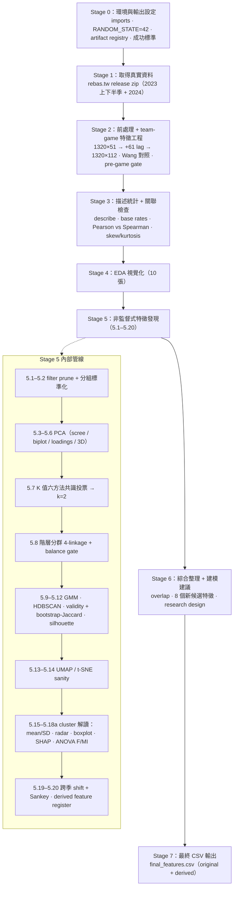

# TL;DR — CPBL 非監督式特徵發現（2023 + 2024）

> 兩到三分鐘可讀完的專案總覽。所有數字取自版本控管的產出物
> （`README.md` 主要結論表、`Results/stage{2..6}/`、已執行的
> `Scripts/cpbl_unsupervised_feature_discovery.ipynb`），非撰稿時重算。
> 想直接看完整渲染報告，開 [`Results/notebook_executed.html`](Results/notebook_executed.html)。

---

## 1. 專案簡介（目標）

114-2 政大資料科學期末專題。從 [rebas.tw](https://github.com/rebas-tw/rebas.tw-open-data)
官方 release 取得 CPBL 中華職棒 **2023 + 2024** 兩季資料，建構 team-game-level
特徵，並**只用非監督式學習**（filter / PCA / 分群 / 降維）找出可作為
**leak-free 預測因子**的衍生特徵——`cluster_id`、PC scores、GMM soft
probabilities——再回頭與學長的監督式 top-10 名單交叉驗證。

- **問題定位**：這不是「預測勝負」的監督式專案（那條線是前期工作，已降級到
  `Scripts/legacy/cpbl_pregame_winprob.ipynb`）。本 notebook 的研究問題是
  **「在不看結果的前提下，team-game 特徵空間裡有沒有可被無監督地發現、
  且能餵給下游模型的結構？」**
- **對照基準**：學長 **王學長** 在 `cde52470/data_science@analyze_wang` 上只分析
  2024 季，用規則式語意標籤 + 監督式模型（logistic / RF / XGBoost + SHAP），
  其跨模型共識 top-10 為 `run_per_hit, innings_pitched, H, scored_first,
  whip_like, hr_allowed, hits_allowed, AB, middle_runs, late_runs`。本研究把
  他的 R 特徵工程移植成 Python 並逐欄對帳，再用非監督結構去佐證 / 擴充這份名單。
- **防洩漏紀律**：Stage 2 另建 60+ 個 `prior_* / opp_prior_* /
  season_to_date_* / h2h_* / stadium_prior_*` **滾動 lag features**（只看過去），
  並以 `USE_PREGAME_ONLY` gate 控制 Stage 5 只吃 pre-game 欄位——確保發現的
  `cluster_id` 本身就是 leak-free 因子。
- **方法來源**：所有手法都對應 `docs/knowledge_base/` 那 10 份從課程
  `course-material/` 蒸餾出來的 KB（PCA-SVD、featureReduction、unsupervised、
  visualization、measurement、SHAP/LIME…），lecture 沒講到的才用業界慣例補。

---

## 2. 流程圖

---

## 3. 各 Stage 說明

### Stage 0 — 環境與輸出設定
- **子目標**：鎖定可重現環境，並建立「先 inline、可選打包」的輸出機制。
- **方法**：import pandas / numpy / sklearn / hdbscan / umap-learn / plotly / shap / kneed，固定 `RANDOM_STATE = 42`、中文字型；定義 `DOWNLOAD_ALL=False`、`ARTIFACTS=[]` 與 `show_and_track()`，所有圖表自動進 registry；渲染 success-criteria 表作為後續 quality gate。
- **結論**：套件全數 import 成功、runtime 版本記錄完成；registry 與輸出開關就緒，預設不寫任何 side-file。

### Stage 1 — 取得真實資料
- **子目標**：100% 從官方 release 取得位元級可重現的原始資料，不依賴任何本機已清理檔。
- **方法**：下載 rebas.tw 三個 release zip（2023 上半季 / 2023 下半季 / 2024），快取後以 `pd.json_normalize` 解析 OpenData JSON，記錄 ODC-By 授權與 source URL。
- **結論**：三個 zip 下載成功、`raw_2023 + raw_2024` 合計約 660 場比賽；資料來源可重現性最大化。

### Stage 2 — 前處理與 team-game-level 特徵工程
- **子目標**：把巢狀 JSON 轉成乾淨的 team-game 特徵矩陣，移植並驗證學長的特徵工程，再建立嚴格 leak-free 的 pre-game 特徵。
- **方法**：合併球季去重 → 1 場拆成 2 列 team-game row → 逐局節奏 / 進攻效率 / 投手防守 / 語意化標籤；2.7a 與學長 `team_game_features.csv` 做 left-merge 逐欄對帳；2.7b 建滾動 lag features；2.9 以 `USE_PREGAME_ONLY` gate 切換 pre/post-game 視角。
- **結論**：`team_game` 由 1320×51 加 lag 後成 **1320×112**（+61 個 `prior_*` 系列）；Wang R port **35/44 數值欄 Pearson r ≥ 0.999**（數值上等價）；`pre_game_ready` **1308/1320（99.1%）**，每隊賽季前 1–4 場因缺 prior window 被標記、後續由 imputer 補中位數；pre-game gate 啟用 → Stage 5 的 `cluster_id` 為 leak-free 因子。

### Stage 3 — 描述統計與關聯檢查
- **子目標**：用 prevalence、關聯性、分布形狀三個維度定位「最該關注哪幾個特徵」。
- **方法**：整體 + 分季 / 分隊 / 主客 `describe`；二元特徵基準率；對 `win` / `run_diff` 同時算 Pearson r 與 Spearman ρ；skew / kurtosis / missing-rate 診斷表。
- **結論**：確認多數 baseball ratio 為 **monotonic-non-linear**（Spearman > Pearson）→ 印證 Stage 5 對重尾欄位用 RobustScaler 是正確選擇；skew/kurtosis 也確認了 HEAVY_TAIL / SYMMETRIC 的分組標準化策略。

### Stage 4 — EDA 視覺化（10 張）
- **子目標**：用視覺化交叉檢查資料品質、季間差異與冗餘結構。
- **方法**：histogram+KDE small multiples、Spearman heatmap、top-5 pairplot、主客平均 grouped bar、每月趨勢、ECDF、球場×週次 calendar heatmap、球隊勝率 bar、H–run_diff hexbin、per-team violin。
- **結論**：十張圖全產出；2023 / 2024 meta 接近、主場優勢仍在、學長 features 在多圖上保留信號；並提示 redundancy 主要集中在 **offense 三組（H/AB/run_per_hit）** 與 **pitching 三組（whip/hits_allowed/bb_allowed）**——直接為 Stage 5.1 的剪枝鋪路。

### Stage 5 — 非監督式特徵發現（5.1–5.20）
- **子目標**：在 pre-game 特徵空間裡，用多演算法交叉驗證地發現穩定、可解釋的群結構，並蒸餾成衍生特徵。
- **方法**：低變異 + |ρ|≥0.95 冗餘剪枝 → 分組標準化 → **PCA**（scree / biplot / loadings / 3D）→ **六方法 K 共識**（elbow / silhouette / CH / DBI / gap / BIC 投票）→ **階層分群 4-linkage + 5% balance gate** → K-Means / GMM / HDBSCAN 並行 → validity panel + **bootstrap-Jaccard** → per-point silhouette → UMAP / t-SNE → cluster mean/SD + radar + notched boxplot + **surrogate RF + Tree-SHAP** + **ANOVA F + MI** → 2023 vs 2024 cluster shift + Sankey → derived feature register。
- **結論**：PCA 需 **24 個 PC** 達 90% 累積 PVE（lag 特徵結構較散，預期內）；六方法投票 ⇒ **k=2**（k=2 與 k=3 並列、取最小）；階層分群中 `average` cophenetic 最高（0.647）但 k=2 退化成 1315 vs 5 外點隔離、被 balance gate 過濾，故 hierarchy 採 **`ward` k=2**；**最終演算法 K-Means k=2**（silhouette ≈ **0.115**、bootstrap-Jaccard ≈ **0.918**——穩定度高、分離度普通，是 pre-game 特徵的自然特性）；ANOVA F+MI 共識排名與 SHAP 命名雙重佐證；**cluster 0 = 近 5–10 場 run_diff↑（球隊熱）、cluster 1 = 近期 run_diff↓（球隊冷）**；`cluster_id` / `gmm_p` / `pc` 已寫入 register；2023 vs 2024 比例 + Sankey 描繪了跨季 meta 變化。

### Stage 6 — 綜合整理與建模建議
- **子目標**：把非監督發現對接回學長名單，產出可放進報告 / 簡報的設計摘要。
- **方法**：focus / lag features 與非監督結構的 overlap 表（PCA loading + SHAP 的 `combined_score` 排序）；列出新增候選特徵；一頁 research design summary。
- **結論**：產出 `stage6_focus_overlap.csv` / `stage6_new_candidate_features.csv` / `stage6_feature_strategy.csv` / `stage6_research_design_summary.csv`；**非監督新增 8 個候選特徵 = `cluster_id` + `gmm_p0..p3` + `pc1..pc3`**，已備妥供下游監督式模型對照。

### Stage 7 — 最終 CSV 輸出
- **子目標**：把整條管線蒸餾成單一、leak-free、可被下游直接吃的特徵檔。
- **方法**：先 preview ARTIFACTS registry；寫出 `final_features.csv`（ORIGINAL + SEMANTIC + NUMERIC + UNSUPERVISED 四群，鍵為 `(game_id, team)`）；`DOWNLOAD_ALL=True` 時一鍵打包 `/tmp/cpbl_artifacts.zip`。
- **結論**：`DOWNLOAD_ALL=False` 預設不留 side-effect，notebook 自含可重現；翻成 `True` 重跑即可重生 `Results/stage*/` 全部 51 個 artifacts。

---

## 4. 主要結論（status quo）

| 指標 | 結果 |
|---|---|
| 樣本數 | **1320** team-game rows（2023 + 2024 去重後） |
| Pre-game features | 60+ 個 `prior_* / opp_prior_* / season_to_date_* / h2h_* / stadium_prior_*` |
| Pre-game ready | **1308 / 1320（99.1%）**；前 1–4 場 NaN 由 imputer 補中位數 |
| Wang R port 對照 | **35 / 44** 數值欄 Pearson r ≥ 0.999（移植數值上等價） |
| PCA k\* @ 90% PVE | **24** PCs |
| K 共識（6 方法投票） | k=2 與 k=3 並列第一 → 採最小 **k=2** |
| 階層分群最佳 linkage | `ward` k=2（cophenetic 0.327；balance gate 過 24.2%）；`average` cophenetic 最高 0.647 但退化成 1315 vs 5、被 gate 過濾 |
| **最終演算法** | **K-Means k=2**（silhouette **0.115**、bootstrap-Jaccard **0.918**） |
| Cluster 解讀 | cluster 0 = 近期 run_diff↑（熱）；cluster 1 = 近期 run_diff↓（冷） |
| 新增候選特徵 | **8 個**：`cluster_id` + `gmm_p0..p3` + `pc1..pc3` |

---

## 5. 交付物與怎麼讀

| 路徑 | 內容 |
|---|---|
| [`Results/notebook_executed.html`](Results/notebook_executed.html) | 程式碼無關的 HTML 報告（11 MB，HackMD 風格 sidebar tabs）：8 個 stage 的渲染輸出 + 中文「結果解讀」，無 Jupyter 也能開 |
| [`Scripts/cpbl_unsupervised_feature_discovery.ipynb`](Scripts/cpbl_unsupervised_feature_discovery.ipynb) | 主 notebook（193 cells，含 inline outputs；每個 code cell 前都有【目標 / 說明 / 解釋結果】三段式 markdown） |
| `Results/stage{2..6}/` | 51 個 CSV / PNG / HTML 產物，按 stage 分資料夾（stage5 再分 10 個編號子主題） |
| [`docs/plan.md`](docs/plan.md) | 研究計畫書（goal / context / verification / risks） |
| `docs/knowledge_base/` | 從 `course-material/` 蒸餾的 10 份方法論 KB |
| `Scripts/legacy/` | 前期 pre-game 監督式 win-prediction 舊 notebook（已被本研究取代，保留備查） |

**一鍵重建**：`./master.sh`（執行 notebook + 重生 HTML；第一次跑會自動下載 2024 release zip）。

---

## 6. 下一步建議

- `DOWNLOAD_ALL=True` 重跑 → 重生 51 個 `Results/stage*/` artifacts，再跑 `Scripts/build/reorganize_stage5.py` 把 flat 輸出搬進 10 個子資料夾、`Scripts/build/build_report_html.py` 重生 HTML 報告。
- **開一個 supervised baseline notebook**，比對「Wang 原始 features」vs「Wang + 本 notebook 的 `cluster_id` / `pc` / `gmm_p`」的 AUC，**量化非監督特徵實際帶來多少提升**——這是把本研究價值落地的關鍵一步。
- 若想看 post-game 視角的 game-archetype，把 `USE_PREGAME_ONLY=False`、從 Stage 5 起重跑。
