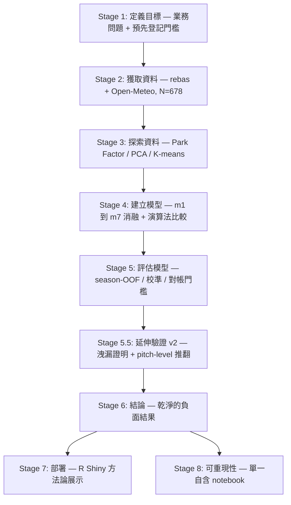

# TL;DR — CPBL 主客場勝率預測期末專案

> 一份兩到三分鐘可讀完的專案總覽。所有數字取自已定案、版本控管的產出物（`Results/eval/_final_metrics.json`、`reports/03_step1_to_step3.md`、執行後報告 `Results/v1_final_report.html`），非撰稿時重算。

---

## 1. 專案簡介（目標）

本專案是政大資料科學（114-2）期末作業，主題為中華職棒（CPBL）主客場勝負預測。核心問題單純而明確：**僅憑一場「尚未開打」的例行賽賽前可得資訊，能否預測主隊是否獲勝？** 目標變數為二元分類 `is_home_win ∈ {0, 1}`，分析單位是「一場比賽」，平手場次（極少數）剔除。

- **資料**：兩季公開資料（2023–2024，共 678 場）。比賽來自野球革命（rebas）open data，天氣改用 Open-Meteo（ERA5 重分析）。嚴守課程限制：禁用 Kaggle 與任何預打包資料集。
- **方法骨幹**：m1–m7 漸進消融，量化「球場、天氣、球隊戰力、打者狀態、投手」五組特徵各自的邊際貢獻；搭配時間感知切分、walk-forward 樣本外（OOF）預測、bootstrap 信賴區間與校準分析。
- **預先登記門檻**（避免事後挑指標）：(a) 必勝 — Test AUC 顯著優於 m1 截距；(b) 可發表 — Test AUC ≥ 0.60；(c) 可部署 — Test AUC ≥ 0.62 且校準良好。
- **真正的貢獻不是高 AUC 數字**，而是一套能正確揭露「此問題在現有資料下接近不可預測」的嚴謹方法論，以及對既有論文目標洩漏（target leakage）的可視化證明。

> 註：charter 原規劃以 R／tidymodels 為主，因 Colab 執行過慢且教師後續允許 Python，全流程改以 Python 單一自含 notebook 實作，R 程式碼降級為交叉驗證的參考鏡像。

---

## 2. 流程圖

---

## 3. 各 Stage 說明

### Stage 1 — 定義目標 Define the Goal
- **子目標**：把「預測 CPBL 主隊勝負」這個模糊意圖，轉成可證偽、可量測的二元分類問題，並事前鎖定成功門檻。
- **方法**：定義 `is_home_win` 與分析單位（一場比賽）；在 charter 中預先登記三個門檻 (a)/(b)/(c) 與兩個假設（HS 球場、HW 天氣）。以最嚴苛的「運彩分析師」利害關係人為準，要求模型同時具備排序能力（AUC）與機率校準。
- **結論**：產出可作為下游唯一真實來源的 charter（`Results/01_define_the_goal.md`）；第 5 階段會逐條對帳這些門檻。

### Stage 2 — 獲取資料 Acquire Data
- **子目標**：從公開、免金鑰來源取得位元級可重現的原始資料，原始資料視為「寫一次、永不竄改」的 WORM 儲存。
- **方法**：rebas open data（含逐場逐球員打擊／投球成績）＋ Open-Meteo（CWA CODiS 遭 CAPTCHA 阻擋後改用）。每個來源檔記 SHA256；天氣缺漏率 >50% 即硬失敗。採嚴格時間感知切分：train 406 場、valid 97 場、holdout 47 場。
- **結論**：修正一個寫死的 `CPBL-` 檔名 glob bug（中文檔名的 2023 賽季被靜默吃掉），樣本數由 366 增至 **678**。教訓「靜默資料遺漏比程式崩潰更危險」直接催生第 8 階段的驗證機制。極小的 47 場 holdout 也埋下後續假訊號的根源。

### Stage 3 — 探索資料 Explore the Data
- **子目標**：在最便宜的階段殺掉壞假設、挖出資料品質地雷。
- **方法**：時間感知（leave-one-out）Park Factor；驗證 rebas pitcherBox schema（每場每邊恰好一筆 `order==1`，1356 個 game-side 零例外）；非監督探索做天氣 PCA 與比賽輪廓 K-means（k=4）；v2 另交付 leak-free 特徵的分布／相關矩陣／PCA 三張圖。
- **結論**：球場效應明確（澄清湖 ≈1.18 打者友善、天母 ≈0.86 投手友善）。但 PCA 中主隊勝／負兩群完全重疊、K-means 各群勝率持平基準線——**結構存在於「打法」中，卻不存在於「勝負」中**，從非監督角度獨立印證了負面結論。

### Stage 4 — 建立模型 Build the Model
- **子目標**：先固定演算法、變動特徵組以量化各組邊際貢獻；再固定特徵、變動演算法以選引擎。
- **方法**：全部 leak-free 特徵工程（Elo K=4／主場 +24、Pythagenpat 30 場、休息天數、Park Factor、打者滾動 OPS/HR/K%/BB%、投手近 5 場＋全隊 30 場成績）。m1（純主場優勢截距）→ m7（五組全特徵），固定 logistic regression 做消融；演算法比較涵蓋 logit／glmnet／RandomForest／XGBoost／LightGBM，皆以 `TimeSeriesSplit(5)` GridSearchCV 調參。
- **結論**：charter 舊 m6（球場＋天氣）實測 season-OOF ≈0.467（與雜訊無異）而退役，槽位改鎖定為「投手」——rebas 中唯一尚未開採、最可能帶訊號的槓桿。選模一律以 CV-AUC 而非 47 場 holdout 決定（holdout 95% CI 寬達 ±0.18，據此選模等同擲銅板）。

### Stage 5 — 評估模型 Evaluate the Model
- **子目標**：判定各特徵組的訊號真偽——AUC 給排序、校準給信任、信賴區間給不確定性。
- **方法**：五次完整執行（Run A–E）逐步排除限制；對 m1–m7 各組做 leak-free walk-forward season-OOF（455 場）作為穩健主指標；單一 isotonic 校準（僅在降低 Brier 時採用）；雙閾值報告。
- **結論**：**乾淨的負面結果**。各組 season-OOF AUC 全落在 0.50 附近 ±0.05 帶內（m2 球場 0.512、m3 天氣 0.524、m4 球隊 0.500、m5 打者 0.500、m6 投手 0.463、m7 全部 0.495）。最具啟發性的是投手：47 場 holdout 上看似亮眼的 **AUC 0.689，在 leak-free walk-forward 上跌至 0.463**（圖 4 核心），是繼 Run A（RF holdout 0.656）之後第二次被同一套方法論自動戳破的小樣本假訊號。生產模型為調參後 RandomForest（CV-AUC 0.546、holdout 0.640、CI [0.451, 0.806]、season-OOF 0.528），且因 isotonic 校準反而惡化 Brier 而誠實服務 raw 機率。**三個成功門檻全部未達、兩個假設皆不獲支持**——而這正證明預先登記嚴謹檢定的必要。

### Stage 5.5 — 延伸驗證 v2（洩漏證明 + pitch-level 推翻嘗試）
- **子目標**：檢驗同聯盟同資料的論文（Lo et al., 2025，報告 AUC 0.97–0.98）是否真有訊號，並用尚未開採的逐球（pitch-by-pitch）資料做最後一搏的推翻嘗試。
- **方法**：以 leak-free 方式重現論文特徵菜單；逐球特徵推翻規則於執行前預先登記（saber＋pitch 須優於 saber-only 且配對 95% bootstrap CI 不相交，N=380 配對列）。
- **結論**：**洩漏可視化證明**（圖 8，最不含糊的貢獻）——同場 wOBA AUC 0.93 vs 賽前滾動 wOBA AUC 0.46，證實論文 ≈0.97 全來自同場目標洩漏。pitch-level 推翻**未達正式門檻**（所有模型配對 CI 重疊），但 5/5 base model 方向一致提升約 +0.05（最佳 RF 達 0.546、CI 上緣 0.604，觸及運動預測 leak-free 文獻天花板 0.57–0.60 下緣）。因 N=380 的標準誤 ≈0.05 恰等於效果量，且 rebas 無更多 release，CI 重疊是資料量硬上限。誠實表述：box-score 的「無訊號」不外推為「pitch-level 亦無訊號」，真相在中間——「具提示性但統計不確定」。

### Stage 6 — 結論
- **子目標**：誠實總結專案達成與否。
- **方法**：對帳預先登記門檻、援引運動預測文獻定位結果。
- **結論**：在兩季規模、box-score 特徵下，CPBL 單場主隊勝負於賽前**接近不可預測**；此為文獻可預期的結果而非專案失敗（見下方總結）。

### Stage 7 — 部署 R Shiny
- **子目標**：把產出物變成可被點擊理解的展示。
- **方法**：precompute 契約（`predictions.csv`、`best_model.joblib`、`feature_schema.json` 與六張圖），R Shiny 零計算、僅渲染（不用 reticulate，部署安全）。
- **結論**：定調為**方法論展示而非預測產品**——以圖 4 的 holdout 陷阱為核心，誠實呈現「walk-forward AUC ≈ 0.53、附信賴區間」，避免任何「精準預測」措辭。

### Stage 8 — 可重現性
- **子目標**：確保整條流程一鍵可重現、不存在 stale 程式。
- **方法**：單一自含 notebook `python/cpbl_pipeline.ipynb`（12 cell），Colab 中 Run all 即由上而下跑完；內建程式版本驗證與「投手特徵確實進入產出物」的硬斷言；完整決策日誌記於 `reports/progress.md`。
- **結論**：以 `build_report_html.py` 產出單檔、UTF-8、中文安全（base64 內聯九張圖、不需 pandoc／LaTeX）的自含報告，瀏覽器開啟即可列印 PDF。

---

## 4. 總結

- **達成了什麼**：一條時序嚴謹、可辯護的評估管線，得到一個**乾淨的負面結論**——在現有兩季公開資料下，沒有任何特徵組（球場／天氣／球隊戰力／打者／投手）能在嚴謹樣本外評估中與「純主場優勢」區分，各組 season-OOF AUC 全在 0.50 附近 ±0.05 帶內。
- **方法論價值（最具教學意義）**：管線兩度自動戳破誘人的小樣本 holdout 假訊號（RF 0.656、投手 0.689→0.463），是「為何不可用小樣本 holdout 排名」的活教材；並產出圖 8 的洩漏可視化證明，實證同聯盟論文 AUC 0.97 全來自同場目標洩漏。
- **結果合理性**：此負面結果與文獻一致——即使 Las Vegas 盤口在 MLB 也僅約 58.2% 準確率、學術模型約 57–59.5%；兩季 CPBL 得到 ≈0.50–0.53 樣本外 AUC，落在理論天花板之下的合理位置。
- **限制**：僅兩季樣本；rebas 不提供賽前 probable starter（投手特徵僅能回溯評分，無法支援真正的「今日」推論）；CPBL 樣本量遠小於 MLB；pitch-level 訊號因 N=380 而統計不確定。
- **後續工作**：box-score 層級的特徵與調參已關閉（在此 N 下等同擬合雜訊）；唯一有紀律的延伸是 pitch-level 推翻消融。若未來 rebas 釋出更多賽季（目前無 2025／2026 release），可重新檢驗 pitch-level 那條「具提示性」的正向訊號是否能跨過正式門檻。部署交由 Sub-Agent 6（R Shiny）落地為方法論展示儀表板。
