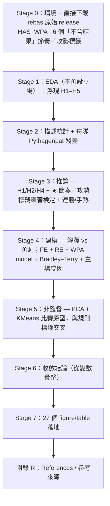

# TL;DR — CPBL 主客場勝負分析：節奏／情勢，而非「得分量」(2023 + 2024)

> 兩到三分鐘可讀完的專案總覽。所有數字取自版本控管的產出物
> （`README.md` 主要結論表、`Results/stage{1..5}*/`、已執行的
> `Scripts/converge_analysis.ipynb`），非撰稿時重算。
> 想直接看完整渲染報告，開 [`Results/notebook_executed.html`](Results/notebook_executed.html)。

---

## 1. 專案簡介（目標）

114-2 政大資料科學期末專題。研究問題：**單看「得分多寡」是否足以解釋中華職棒
主場與客場的勝負差異？若不夠，是「節奏／情勢」補上了什麼？**

從 [rebas.tw](https://github.com/rebas-tw/rebas.tw-open-data) 官方 release 取
得 CPBL **2023 + 2024** 賽季逐場 JSON（含**逐打席 WPA/homeWE/RE24**），以
**team-game**（一隊一場）為單位、把球隊當分組因子，循嚴謹科學流程
（EDA → 描述 → 推論 → 建模 → 非監督 → 結論）回答上述問題。

- **方法紀律**：所有【解釋】由變數動態生成（無硬寫數字）；含結果的標籤
  （`game_flow_label`）僅做描述、不進推論（**circularity 安全閥**）；
  賽前預測階段全程 leak-free 滯後特徵（GroupKFold by game_id）；多重比較
  Holm/BH 校正；手熱檢定以置換內含 Miller–Sanjurjo 偏誤校正。
- **方法／風格參考**：同學的非監督式特徵發現專案
  （`cde52470/data_science@data-analysis`）— 包含 stage 結構、HTML 報告
  三段式樣板、CSS/JS。詳見報告附錄 R.1。

---

## 2. 流程圖

---

## 3. 各 Stage 說明

### Stage 0 — 環境、開關與資料載入
- **方法**：固定 `RANDOM_STATE = 42`、註冊已安裝 CJK 字型避開 matplotlib 快取
  bug；以 env 控制 `SEASON_SCOPE`／`EXPORT_OUTPUTS`／`USE_TIME_LAG`；
  `RebasLoader` 透過 GitHub releases 直接下載並解析 zip；`FeatureBuilder`
  把巢狀 JSON 轉成 game-level + team-game 兩視角；`LabelBuilder` 建立
  6 個**不含最終勝負**的節奏／攻勢標籤（先馳得點、六局領先態勢、後段得分
  占比、攻勢強度 RE24、得分水準、情勢掌控 正WPA）。
- **結論**：去和局後 **647 場 → 1294 team-game**，6 隊、2023-04-01 ~ 2024-10-11；
  **HAS_WPA = True**（用真實 per-PA WPA 為情勢核心）。

### Stage 1 — EDA（探索，不預設立場）
- **方法**：主客輪廓雙軸圖 + 每隊主／客勝率；得分分布 KDE + 勝差 KDE；
  team-game 特徵 vs win 的 Spearman 熱圖。
- **結論**：主場勝率 **52.9%** > 客場 47.1%，但主場平均得分 4.19 **反而略低**；
  主場優勢**因隊而異**（台鋼 +0.158 ~ 中信 −0.056）；自身得分量與勝負正相關
  （`run_diff` ρ=0.87）但主場偏向小分差取勝。由觀察浮現 H1–H5，H4
  （節奏／情勢）為核心。

### Stage 2 — 描述統計（含 Pythagenpat）
- **方法**：主客均值差表 + 每勝得分效率；Pythagorean 固定指數 + **Pythagenpat
  動態指數** `((RS+RA)/G)^0.287` 計算主客／每隊的實際 vs 期望勝率殘差。
- **結論**：主隊每勝平均得分 **5.82 < 客隊 6.26**（效率取勝線索）；
  **Pythagenpat 主場殘差 +0.035** ↔ 客場 −0.035 — 把相同得失分更有效率
  轉成勝場。

### Stage 3 — 推論統計（H1–H5）
- **方法**：卡方+Cramér's V／Mann-Whitney U／邏輯迴歸不分箱；**★ 對 6 個
  「不含結果」標籤逐一做卡方 ×win + V + 各類別勝率 bootstrap 95% CI +
  Holm/BH 校正**；逐隊主／客勝率 + Wilcoxon；手熱以置換檢定建虛無分布
  （內含 Miller–Sanjurjo 偏誤校正）。
- **結論**：H1（情勢×勝負 p=0.009、V=0.121）與 H2（MWU p=0.002、rank-biserial
  0.139 CI 不含 0）皆顯著；**★ 6/6 節奏／攻勢標籤 BH<.05 全部顯著**，效果量
  排序：六局領先態勢 V=**0.73**（最強，勝率差 78%）> 攻勢RE24 0.60 >
  得分水準 0.56 > 先馳得點 0.41 > 情勢掌控 0.32 > 後段得分占比 0.18；
  手熱差 −0.009、置換 **p=0.623 → 不存在**。

### Stage 4 — 建模（解釋 vs 預測）
- **方法**：邏輯迴歸 FE + cluster-robust SE（4a）；混合效果（team 隨機截距）
  + 情勢掌控 WPA 模型（4a 補）；GroupKFold AUC + permutation importance
  （4a 續）；time-lag 滯後特徵（leak-free）GroupKFold by game_id（4b）；
  Bradley–Terry 分離球隊實力與 HFA（4c）；球場層級主隊勝率（4d）。
- **結論**：控制球隊後 **is_home OR=2.09（p=0.006）穩健**（隊內效應）；
  情勢模型 high_lev_wpa OR=2.27、bat_re24 OR=2.01；解釋 AUC **0.843→0.960**
  由 `led_after_6` 主導，is_home permutation importance 僅 0.003 — **顯著
  ≠ 預測增益大**；**leak-free 賽前 AUC 0.506 ≈ 隨機**、同場洩漏 0.960；
  Bradley–Terry HFA **+0.116 logit**（p=0.143）→ 對等對戰主隊勝率 0.529；
  球場層級主隊勝率 臺南 63.4% ↔ 新莊 43.8%。

### Stage 5 — 非監督觀察
- **方法**：標準化 → PCA（scree + 2D 散點以 win 上色 + loadings）→ KMeans
  （k 由 silhouette 選）→ 各群剖面（平均特徵 + 勝率 + 主客比例）→ 與
  規則 `game_flow_label` 交叉表。
- **結論**：PCA 需 **10 個 PC** 達 90% 變異；silhouette 在 **k=2 最高（0.208）**；
  **群 #0 勝率 84%**（淨分差 +3.2、六局領先 +0.59、攻勢RE24 +2.15）vs
  **群 #1 勝率 22%**；**兩群主場比例皆 ≈ 0.5** — 分群**不是主客而是節奏／
  情勢掌控**。資料驅動分群與規則節奏標籤一致，再次佐證節奏／情勢是勝負主軸。

### Stage 6 — 收斂結論
- **回答**：得分『量』**不足以**解釋主場優勢；節奏／情勢補上關鍵；主場優勢
  **「可解釋、難預測」**（控制後 is_home 穩健、Bradley–Terry 確認真實但
  溫和；賽前 leak-free 預測 ≈ 隨機）。
- **侷限**：原始資料無觀眾／裁判，主場成因僅能看球場層級；單一聯盟、
  球隊數少（H5 跨隊一致性檢力不足）；跨年 pooled（已逐季重置滾動特徵
  並控 season）；Bradley–Terry 將實力視為跨季固定，為近似。

### Stage 7 — 輸出
- 共 **27 個輸出（9 圖 / 18 表）**寫入 `Results/stage{1..5}*/`；本 HTML
  報告即由其組成。

---

## 4. 主要結論（status quo）

| 指標 | 結果 |
|---|---|
| 樣本數 | **1294** team-game rows（647 場 · 2023+2024 去和局） |
| 主場勝率 | **52.9%**（主場得分 4.19 < 客場 4.25） |
| Pythagenpat 主場殘差 | **+0.035** |
| ★ 節奏／攻勢標籤顯著數 | **6 / 6**（最強 六局領先態勢 V=0.73、勝率差 78%） |
| 解釋 is_home OR (加 C(team)) | **2.09** (p=0.006) |
| Bradley–Terry HFA | +0.116 logit → 對等主隊勝率 0.529 |
| 手熱效應 | **p=0.623（不存在）** |
| **預測 AUC** | **leak-free 0.506 / 同場洩漏 0.960** |
| 非監督 KMeans k=2 | 群#0 勝率 84% vs 群#1 22%（主場比皆≈0.5） |
